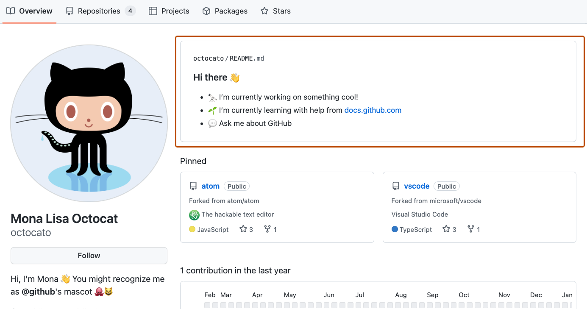
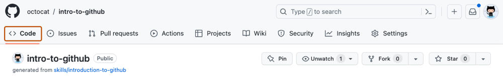

## ステップ 1: ブランチを作成する

_「GitHub入門」へようこそ！ :wave:_

**GitHubとは？**: GitHubは、バージョン管理に _[Git](https://docs.github.com/get-started/quickstart/github-glossary#git)_ を使うコラボレーションプラットフォームです。
GitHubは[オープンソース](https://docs.github.com/get-started/quickstart/github-glossary#open-source)ソフトウェアを共有・貢献するための人気のある場所です。

:tv: [動画: What is GitHub?（英語）](https://www.youtube.com/watch?v=pBy1zgt0XPc)

**リポジトリとは？**: _[リポジトリ](https://docs.github.com/get-started/quickstart/github-glossary#repository)_ はファイルやフォルダを含むプロジェクトのことです。
リポジトリはファイルやフォルダのバージョン（変更履歴）を追跡します。詳しくは
「[リポジトリについて](https://docs.github.com/ja/repositories/creating-and-managing-repositories/about-repositories)」をご覧ください。

**ブランチとは？**: _[ブランチ](https://docs.github.com/ja/get-started/quickstart/github-glossary#branch)_ はリポジトリの並行バージョンです。
デフォルトでは、リポジトリには `main` という名前のブランチが1つあり、これが正式なブランチとみなされます。
追加のブランチを作成すると、`main` ブランチのコピー上で安全に変更を加えることができ、メインプロジェクトに影響を与えません。
多くの人がブランチを使って、プロジェクトの他の部分に影響を与えずに特定の機能を開発しています。

ブランチを使うと、`main` ブランチから作業を分離できます。
つまり、あなたが作業している間も、他のみんなの作業は安全です。
詳しくは「[ブランチについて](https://docs.github.com/ja/pull-requests/collaborating-with-pull-requests/proposing-changes-to-your-work-with-pull-requests/about-branches)」をご覧ください。

**プロフィールREADMEとは？**: _[プロフィールREADME](https://docs.github.com/account-and-profile/setting-up-and-managing-your-github-profile/customizing-your-profile/managing-your-profile-readme)_
は、GitHub.comのコミュニティに自分自身の情報を共有できる「自己紹介」セクションのようなものです。
GitHubはプロフィールページの上部にプロフィールREADMEを表示します。詳しくは「[プロフィールREADMEの管理](https://docs.github.com/ja/account-and-profile/setting-up-and-managing-your-github-profile/customizing-your-profile/managing-your-profile-readme)」をご覧ください。

### :keyboard: やってみよう: 最初のブランチ

1. 新しいブラウザタブを開き、あなたが作成したリポジトリ（このコースのコピー）に移動してください。このタブの説明を読みながら、もう一方のタブで作業を進めましょう。

2. リポジトリのヘッダーメニューにある **< > Code** タブをクリックしてください。

   

3. **main** ブランチのドロップダウンをクリックしてください。

   

4. **Find or create a branch...** のテキストボックスに `my-first-branch` と入力してください。

   > **注:** これは次のステップに進むためにチェックされます。 :wink:

5. **Create branch: `my-first-branch` from main** というテキストをクリックして、ブランチを作成してください。

   

   - ブランチは自動的に、今作成したブランチに切り替わります。
   - **main** ブランチのドロップダウンメニューに新しいブランチ名が表示されます。

6. ブランチがGitHubにプッシュされたので、Monaがあなたの作業をチェックしているはずです。少し待って、コメントを確認してください。進捗情報と次のレッスンが表示されます。

うまくいかない場合 🤷
 

フィードバックが表示されない場合は、以下を確認してください：
- ブランチ名が正確に `my-first-branch` であることを確認してください。プレフィックスやサフィックスは付けないでください。

