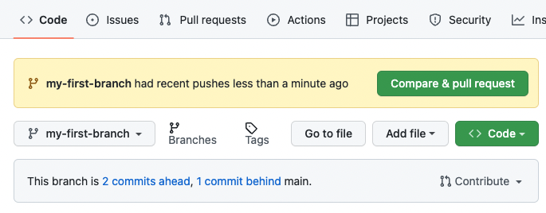
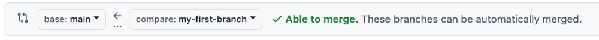

## ステップ 3: プルリクエストを作成する

_コミットお見事です！ :sparkles:_

プロジェクトに変更を加えてコミットができたので、次はプルリクエストを通じて変更の提案を共有しましょう！

**プルリクエストとは？**: コラボレーションは _[プルリクエスト](https://docs.github.com/ja/get-started/quickstart/github-glossary#pull-request)_ 上で行われます。プルリクエストは、あなたのブランチの変更内容を他の人に見せ、変更を承認・却下したり、追加の変更を提案したりできるようにします。このプルリクエストでは、あなたがブランチで行った変更を保持しつつ、それを `main` ブランチに適用することを提案します。プルリクエストについて詳しくは「[プルリクエストについて](https://docs.github.com/ja/pull-requests/collaborating-with-pull-requests/proposing-changes-to-your-work-with-pull-requests/about-pull-requests)」をご覧ください。

### :keyboard: やってみよう: プルリクエストを作成する

コミット後に、最近のプッシュを知らせるメッセージと **Compare & pull request** ボタンが表示されたことに気づいたかもしれません。

自動的にプルリクエストを作成するには、**Compare & pull request** ボタンをクリックして、以下の手順5に進んでください。または、手順1〜4で手動で作成する練習もできます。

1. リポジトリのヘッダーメニューで **Pull requests** タブをクリックしてください。
2. **New pull request** ボタンをクリックしてください。
3. ドロップダウンメニューで以下のブランチを選択してください。

   - **base:** `main`
   - **compare:** `my-first-branch`

   

4. **Create pull request** をクリックしてください。

5. プルリクエストのタイトルを入力してください。デフォルトではブランチ名が自動的にタイトルになります。今回は `Add my first file` に変更してください。

6. 次のフィールドでは、行った変更の **説明** を入力できます。ここまでに行ったことの簡単な説明を入力してください。振り返ると、新しいブランチの作成、ファイルの作成、コミットの作成を行いました。

   

7. **Create pull request** をクリックしてください。

8. コラボレーションの場を作成したので、Monaがあなたの作業をチェックしているはずです。少し待って、コメントを確認してください。進捗情報と次のレッスンが表示されます。

うまくいかない場合 🤷
 

フィードバックが表示されない場合は、以下を確認してください：
- プルリクエストのタイトルが正しいことを確認してください。
- プルリクエストに説明が入力されていることを確認してください。

