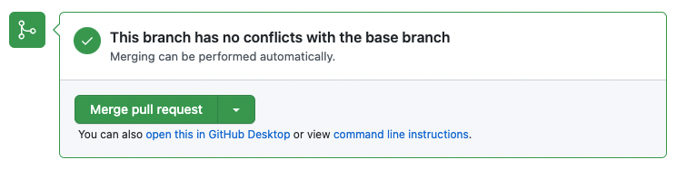

## ステップ 4: プルリクエストをマージする

_よくできました！ :sunglasses:_

プルリクエストの作成に成功しました。次はマージしましょう！

**マージとは？**: _[マージ](https://docs.github.com/ja/get-started/quickstart/github-glossary#merge)_ はプルリクエストとブランチの変更を `main` ブランチに追加することです。マージについて詳しくは「[プルリクエストのマージ](https://docs.github.com/ja/pull-requests/collaborating-with-pull-requests/incorporating-changes-from-a-pull-request/merging-a-pull-request)」をご覧ください。

### :keyboard: やってみよう: プルリクエストをマージする

1. **Merge pull request** をクリックしてください。

   > **注:** 新しいプルリクエストでワークフローが実行されていて、マージボタンが無効になっている場合があります。少し待てばワークフローが完了し、マージボタンが有効になります。

2. **Confirm merge** をクリックしてください。

   > **ヒント:** このダイアログがファイル追加の時と似ていることに気づきましたか？マージもコミットの一種です！

3. ブランチがマージされたら、もうそのブランチは必要ありません。ブランチを削除するには **Delete branch** をクリックしてください。

   

4. マージが完了すると、Monaが確認メッセージと最終レビュー内容を共有します。お疲れ様でした！ 🎉

うまくいかない場合 🤷
 

フィードバックが表示されない場合は、以下を確認してください：
- 前のレッスンが完了していることを確認してください。完了していない場合、マージボタンはグレーアウトされます。

